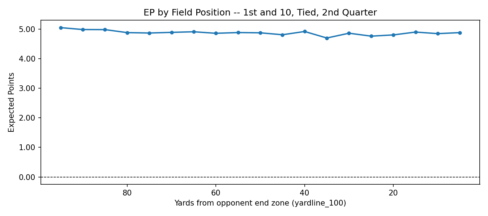
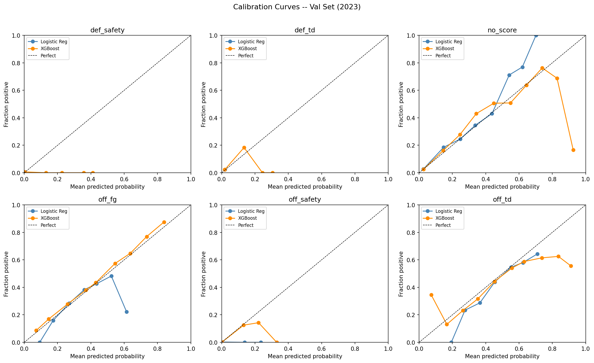
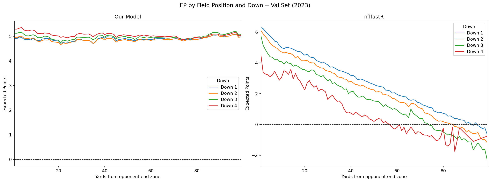
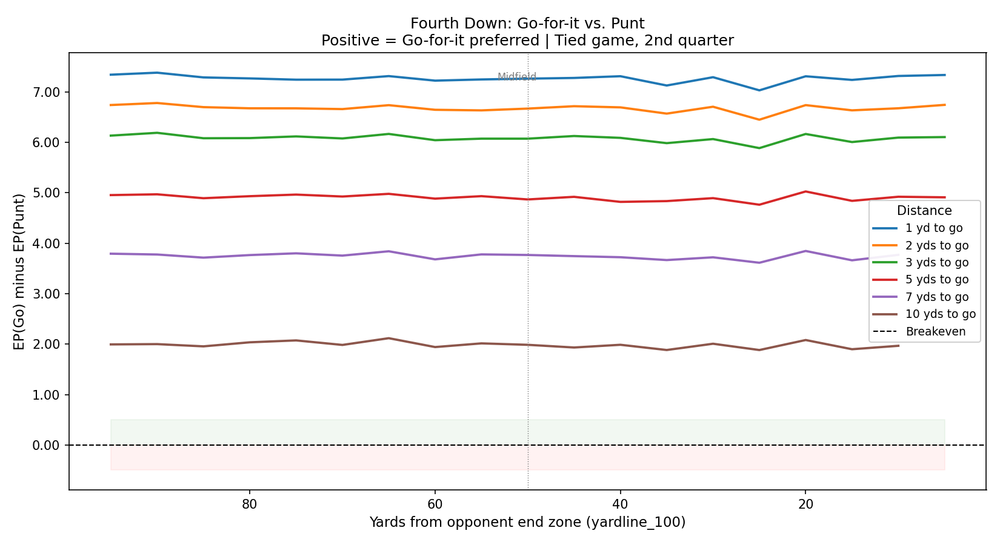

# NFL Expected Points Model

A from-scratch Expected Points (EP) model built on NFL play-by-play data. The model predicts the probability of each of six next scoring outcomes for any scrimmage situation and uses those probabilities to compute EP. The project ends with a fourth down decision application that shows when going for it is EP-positive compared to punting or kicking a field goal.

Built as a portfolio project targeting NFL and college football analytics roles. The emphasis is on understanding the methodology and being able to defend every decision, not just shipping code.

---

## What Is Expected Points

EP is how many points the offense is projected to score before the next change of possession, given the current down, distance, and field position. It is computed as a probability-weighted sum across six possible next scoring outcomes.

EPA (Expected Points Added) is the change in EP from one play to the next. A play that moves the offense from a 0.5 EP situation to a 1.2 EP situation generated 0.7 EPA. EPA is what gets assigned to individual plays and players.

---

## Project Structure

```
nfl-ep-model/
├── data/                         # Local only, excluded from git
│   ├── scrimmage_2021_2023.csv   # Raw filtered play-by-play (270MB)
│   ├── engineered_2021_2023.csv  # Feature-engineered dataset
│   └── fourth_down_results.csv   # Phase 5 decision table output
├── models/
│   ├── xgboost.pkl
│   ├── logistic_regression.pkl
│   ├── scaler.pkl
│   └── label_encoder.pkl
├── figures/
│   ├── ep_field_position_sanity.png
│   └── fourth_down_breakeven.png
├── 01_data_collection.ipynb
├── 02_feature_engineering.ipynb
├── 03_model_training.ipynb
├── 04_validation.ipynb
├── 05_fourth_down.ipynb
├── PROCESS.md
├── DECISIONS.md
├── FINDINGS.md
├── READING_NOTES.md
└── README.md
```

---

## Data

**Source:** `nfl_data_py`, pulling from the nflverse data repository on GitHub. No API key required.

**Seasons:** 2021, 2022, 2023 (149,021 total plays)

**Training set:** 2021-2022 (70,912 scrimmage plays)

**Validation set:** 2023 (35,474 scrimmage plays)

The split is temporal, not random. Plays within a game are not independent, so random k-fold would produce artificially optimistic validation results. Holding out 2023 entirely tests whether the model generalizes forward in time.

---

## Features

| Feature | Description |
|---|---|
| `down_2`, `down_3`, `down_4` | One-hot encoded down, `down_1` as reference |
| `ydstogo_log_scaled` | log1p of yards to go, then standardized |
| `yardline_100_scaled` | Yards from opponent end zone, standardized |
| `yardline_100_sq_scaled` | Squared field position term to capture red zone nonlinearity |
| `score_differential_scaled` | Score from offensive team's perspective, standardized |
| `half_seconds_remaining_scaled` | Seconds left in the half, standardized |
| `is_red_zone_scaled` | Binary flag for opponent's 20 yard line or closer, standardized |

`qtr` was excluded after an initial version showed it dominating feature importance at 44x the gain of `yardline_100_scaled`, acting as a game script proxy and suppressing field position signal.

---

## Models

Two models were trained and compared on 2023 validation log-loss:

| Model | Log-Loss |
|---|---|
| Multinomial Logistic Regression | 0.9235 |
| XGBoost | 0.8979 |

XGBoost was selected as the final model. The margin over logistic regression is modest, which suggests the features carry most of the predictive signal and the nonlinear interactions are limited.

---

## Visualizations

### EP by Field Position (1st and 10, Tied, 2nd Quarter)



*Our model produces a compressed EP range of roughly 0.2 points across all field positions. See Known Limitations below.*

---

### Calibration Curves by Field Position Zone



*`off_fg` tracks the diagonal closely in opponent territory and the red zone. `off_td` is systematically overconfident across all zones.*

---

### EP Curve Comparison: Our Model vs. nflfastR



*nflfastR shows a slope from roughly 6.0 near the opponent end zone down to near zero in own territory. Our model is flat due to the next score definition. See Known Limitations.*

---

### Fourth Down Breakeven: Go-for-it vs. Punt



*Each line represents a distance to gain. Above zero means going for it returns more EP than punting. Note: punt comparisons are unreliable due to the flat EP curve. See Known Limitations.*

---

## Results: Fourth Down Decision Table

Results below are for a tied game with 1800 seconds remaining in the half.

| Situation | EP Go | EP Punt | EP FG | Best |
|---|---|---|---|---|
| 4th and 1, own 25 | 2.439 | -4.804 | -3.882 | Go |
| 4th and 1, own 35 | 2.510 | -4.804 | -2.903 | Go |
| 4th and 1, midfield | 2.460 | -4.804 | -1.616 | Go |
| 4th and 1, opp 40 | 2.508 | -4.804 | -0.663 | Go |
| 4th and 1, opp 30 | 2.431 | -4.862 | 0.271 | Go |
| 4th and 1, opp 15 | 2.429 | -4.810 | 1.684 | Go |
| 4th and 2, own 35 | 1.934 | -4.804 | -2.903 | Go |
| 4th and 2, midfield | 1.866 | -4.804 | -1.616 | Go |
| 4th and 2, opp 35 | 1.808 | -4.763 | -0.210 | Go |
| 4th and 5, own 40 | 0.080 | -4.804 | -2.592 | Go |
| 4th and 5, midfield | 0.064 | -4.804 | -1.616 | Go |
| 4th and 5, opp 35 | 0.073 | -4.763 | -0.210 | Go |
| 4th and 10, own 35 | -2.687 | -4.804 | -2.903 | Go |
| 4th and 10, midfield | -2.818 | -4.804 | -1.616 | FG |
| 4th and 10, opp 30 | -2.855 | -4.862 | 0.271 | FG |

---

## Known Limitations

**Flat EP curve.** The model defines `next_score` as the next scoring event of the entire game, not the current drive. A team punting from their own 1 yard line still gets an `off_td` label if their offense scores three drives later. At the game level, field position on the current play has limited predictive power for who scores next. Without drive context features, the model anchors near the `off_td` base rate of 49% regardless of field position. This is why the EP curve is flat where nflfastR shows a clear slope.

**Punt column unreliable.** Because EP is nearly identical across all field positions, possession change math after a punt produces the same result whether you punt from your own 25 or the opponent's 40. The go-for-it and field goal columns are reliable. Punt comparisons are not.

**Conversion rate approximation.** Fourth down conversion probability uses a linear approximation rather than rates fit directly from the data. Directionally correct, but not precise on edge cases.

Two things would fix the flat curve: redefining `next_score` at the drive level, or adding drive context features like yards per carry, completion percentage, and time of possession. Both are documented in FINDINGS.md.

---

## Reproducing This Project

Data files are excluded from the repo due to size. To reproduce:

```bash
git clone https://github.com/mcisnerosy/nfl-ep-model
cd nfl-ep-model
python -m venv venv
source venv/bin/activate        # Windows: venv\Scripts\activate
pip install -r requirements.txt
```

Then run the notebooks in order: `01` through `05`. Each notebook saves its outputs so the next one can load them without re-running everything.

---

## Documentation

| File | What it covers |
|---|---|
| `PROCESS.md` | Chronological log of what was done and why at each phase |
| `DECISIONS.md` | Every modeling decision with justification and alternatives considered |
| `FINDINGS.md` | Results, calibration analysis, and known limitations |
| `READING_NOTES.md` | Notes from Burke (2010) and the nflfastR methodology |

---

## Acknowledgements

**Ben Baldwin and Sebastian Carl** for building and maintaining nflfastR and the nflverse data ecosystem.

**nfl_data_py** by Cooper Adams, which made pulling nflverse data into Python straightforward without needing to manage raw files or API credentials.

**Brian Burke** (Advanced Football Analytics, 2010) for the foundational EP methodology this project is based on. His original writeup on deriving next score outcomes from play-by-play data was the primary reference for Phase 1.

**The nflfastR EP/WP model writeup** (Open Source Football, 2021) for documenting the XGBoost transition and calibration approach that informed the modeling decisions in Phases 2 and 3.